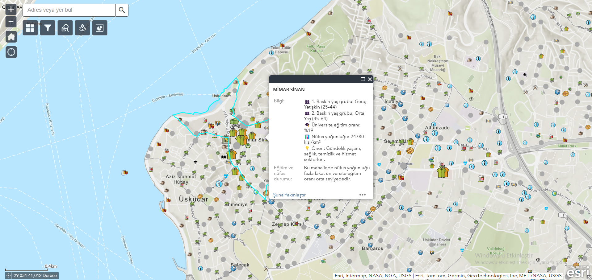

# 📍 Location-Based Business Suitability Analysis App with ArcGIS Web AppBuilder

As part of my internship at Üsküdar Municipality, I developed a WebGIS-based analysis and information application using ArcGIS Web AppBuilder. This application supports users who plan to open a business by enabling them to make data-driven decisions, and also helps existing business owners gain spatial insight into their surroundings.

---

## 🎯 Purpose of the Application

The goal is to provide users with location-based insights by analyzing multi-layered data such as population demographics, competition, education levels, and spatial density — helping identify which type of business is more strategically and sustainably suitable in which location.

---

## 🚀 Application Features

### 1. Neighborhood Pop-up Analysis  
Clicking on a neighborhood reveals dynamic information such as population density, dominant age groups, university graduation rates, and suggests suitable business types based on this data.

### 2. Filtering by Business Type  
Users can filter the map based on the upper category of the business they plan to open (e.g., education, food sales, health services).

### 3. Query by Neighborhood and Street  
Users can query a specific neighborhood or street to see which businesses are located there and how many exist.

### 4. “Near Me” Widget – Proximity Analysis  
By clicking anywhere on the map, users can list all (or filtered) businesses within a customizable distance ranging from 500 meters to 3 kilometers.

### 5. Point-Based Competition Analysis  
Clicking on a business point calculates how many other businesses with the same activity type exist within a 1 km radius.

### 6. Business Count by Neighborhood – Infographic  
An infographic chart dynamically visualizes the number of businesses per neighborhood.

### 7. User Experience Widgets  
- 📍 “My Location” tool  
- 🗺️ Basemap Gallery (street view, satellite, etc.)

---

## ⚙️ Technical Details

- Development: ArcGIS Web AppBuilder  
- Spatial Processing: Arcade Expressions  
- Visualization: Infographics & Symbology  
- Data Preparation: ArcGIS Pro, PostgreSQL/PostGIS

---

## 📦 Data Sources

The data used in this application is based on spatial datasets provided or permitted for use by Üsküdar Municipality.

### 🔹 Main Layers

- **Business Points (Licensed Workplaces)**  
  Contains attributes such as neighborhood, street, business name, main activity, upper category, license info, and coordinates.

- **Neighborhood Layer**  
  Includes administrative boundaries of all neighborhoods in Üsküdar district.

- **Neighborhood Demographics**  
  Contains statistics on age distribution, university graduation rates, total population, etc.

---

## 🎲 Arcade Expressions Used

- [`popup_yas_egitim_yogunluk.arcade`](arcade-expressions/popup_yas_egitim_yogunluk.arcade)
- [`popup_egitim_nufus_durumu.arcade`](arcade-expressions/popup_egitim_nufus_durumu.arcade)
- [`rakip_isletme_sayisi.arcade`](arcade-expressions/rakip_isletme_sayisi.arcade)

---

## 📸 Screenshots

> All screenshots are stored under the `screenshots/` folder:

-  – Main Map View  
-  – Neighborhood Info  
-  – Filter Tool  
-  – Neighborhood/Street Query  
-  – Nearby Businesses  
-  – Business Count by Neighborhood  
-  – Business Detail & Score  

---

## 👨‍💻 Developer

**Kemal Can Erdem**  
📧 LinkedIn: [www.linkedin.com/in/kemal-can-erdem-6483b4327](https://www.linkedin.com/in/kemal-can-erdem-6483b4327)

