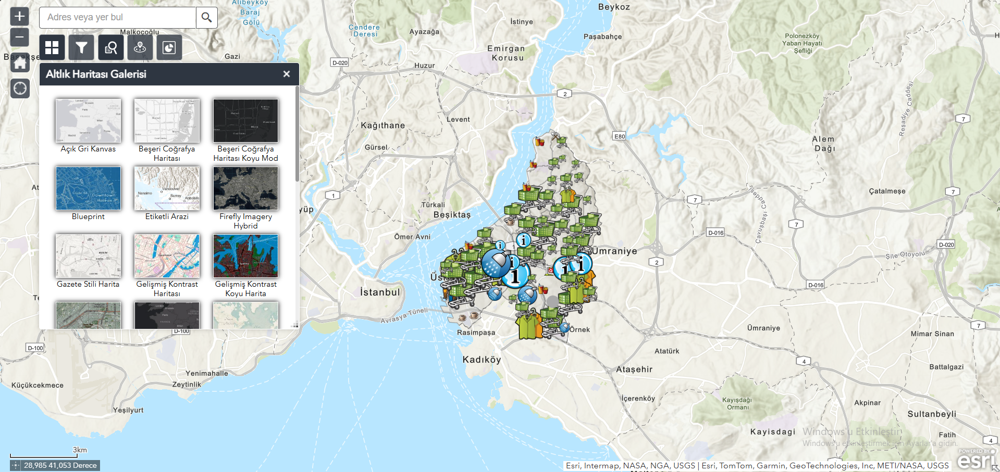
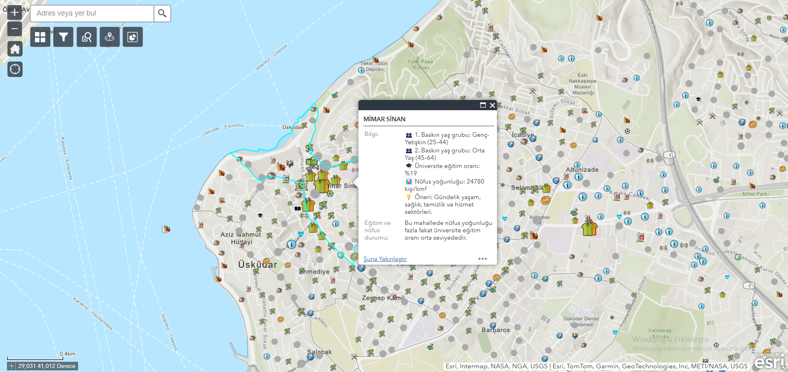
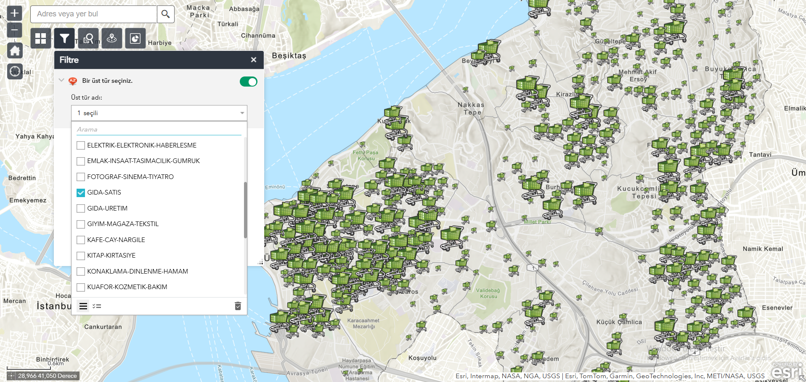
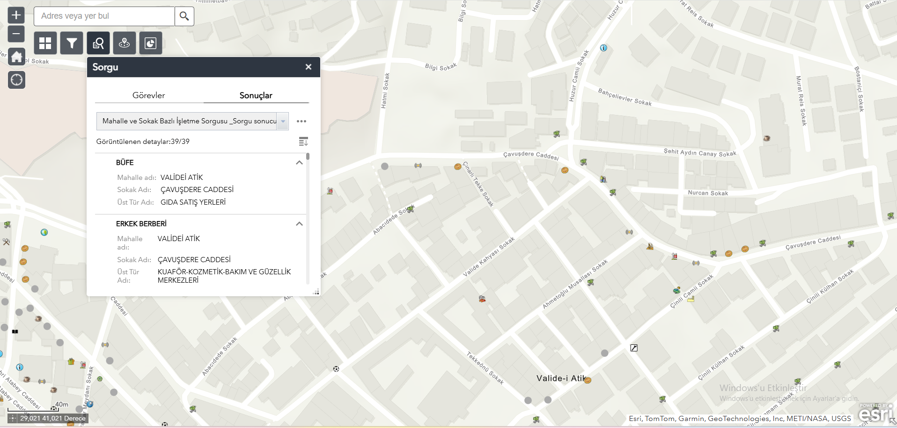
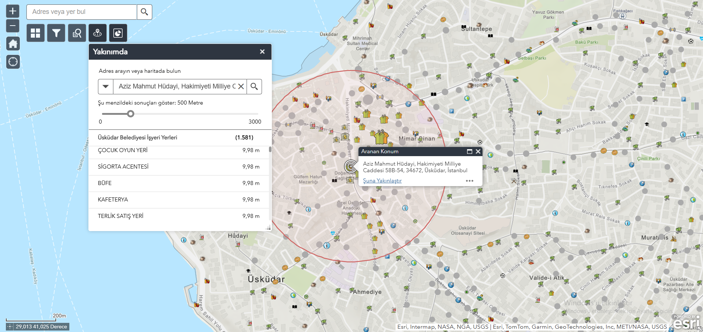
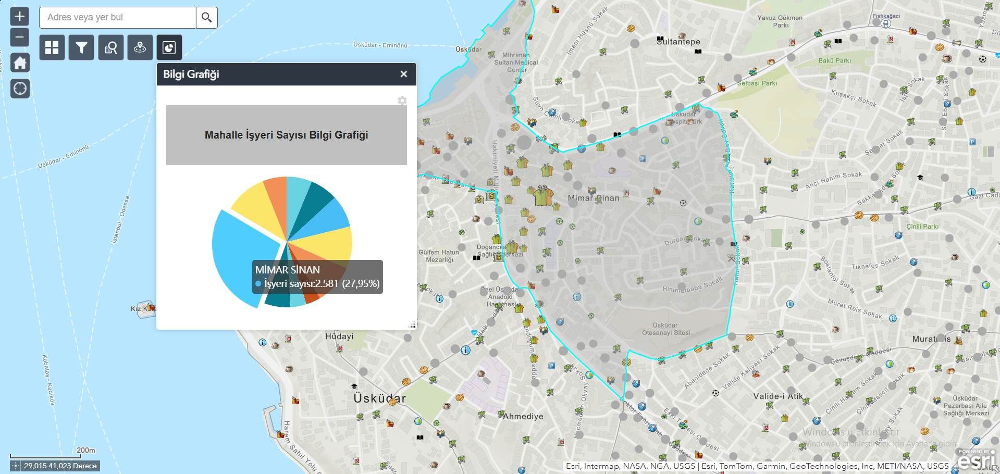
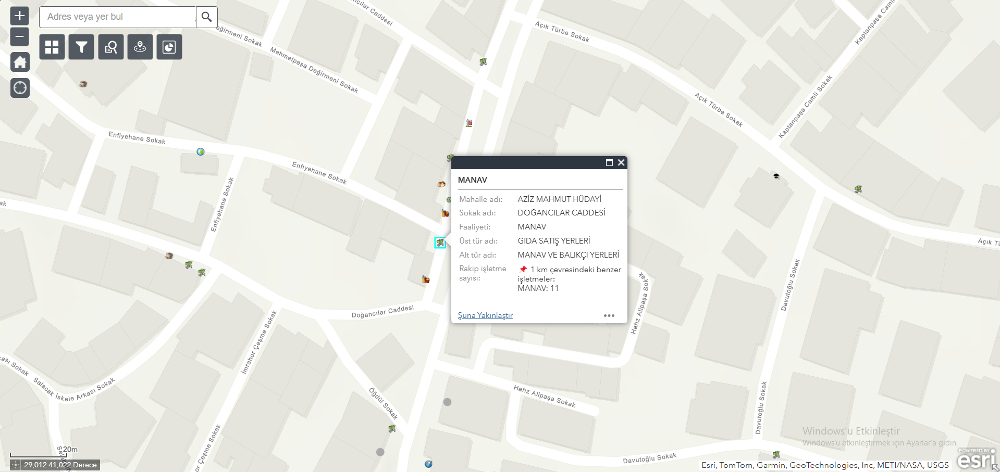

# ArcGIS Web AppBuilder ile Lokasyon Tabanlı İşletme Açılabilirlik Analizi Uygulaması

Üsküdar Belediyesi'nde yaptığım staj kapsamında ArcGIS Web AppBuilder kullanarak; hem işletme açmayı planlayan kullanıcıların veriye dayalı kararlar alabilmesini, hem de mevcut işletme sahiplerinin mekansal verilere göre bilgi edinmesini sağlayan bir WebGIS tabanlı analiz ve bilgilendirme uygulaması geliştirdim.

---

## Uygulamanın Amacı

Kullanıcılara; nüfus yapısı, rekabet durumu, eğitim seviyesi ve mekânsal yoğunluk gibi çok katmanlı verileri analiz ederek, hangi tür işletmenin, hangi lokasyonda açılmasının daha stratejik ve sürdürülebilir olacağına dair konum bazlı içgörüler sunmak ve karar alma süreçlerini desteklemek.

---

## Uygulama Özellikleri

### 1. Mahalle Pop-up Analizleri
Bir mahalleye tıklandığında; mahalle nüfus yoğunluğu, baskın yaş grubu, üniversite mezunu oranı gibi veriler gösterilerek bu verilere göre sektörel işletme açma önerisi ile nüfus-eğitim bilgisi dinamik olarak sunulmaktadır.

### 2. İşletme Türüne Göre Filtreleme
Kullanıcı, açmayı planladığı veya bilgilenmek istediği işletme üst türünü (örneğin eğitim, gıda satış, sağlık) seçerek harita üzerinde filtreleme yapabilir.

### 3. Mahalle ve Sokak Bazlı Sorgu
Kullanıcılar belirli bir mahalle veya sokağı sorgulayarak, o bölgedeki mevcut işletmeleri ve işletme sayılarını görüntüleyebilir.

### 4. “Near Me” Aracı ile Çevresel Analiz
Harita üzerinde herhangi bir noktaya tıklanarak, 500 metreden 3 km’ye kadar olan mesafede kalan tüm veya filtrelenmiş işletmeler listelenebilmektedir.

### 5. Nokta Bazlı Rekabet Analizi
Bir işletme noktasına tıklanarak, 1 km içerisindeki aynı anafaaliyete sahip rakip işletmelerin sayısı hesaplanır.

### 6. Mahalle Bazlı İşletme Sayısı Bilgi Grafiği
Infographic widget kullanılarak mahalle bazlı işletme sayıları grafik olarak görselleştirilmiştir.

### 7. Kullanıcı Deneyimi Odaklı Araçlar
- 📍 Konumum Aracı 
- 🗺️ Harita görünümü Basemap Gallery aracılığıyla değiştirilebiliyor (uydu, sokak haritası vb.)

---

##  Teknik Detaylar

- Geliştirme: ArcGIS Web AppBuilder  
- Mekansal İşlemler: Arcade expressions  
- Görselleştirme: Infographic, sembolleştirme  
- Veri Hazırlık: ArcGIS Pro, PostgreSQL/PostGIS

  ## 📦 Veri Setleri

Bu uygulamada kullanılan veriler, Üsküdar Belediyesi tarafından sağlanan veya kurumsal izinle elde edilen mekânsal veri setlerine dayanmaktadır.

### 🔹 Kullanılan Katmanlar

- **İşletme Noktaları (Ruhsatlı İşyeri Verisi)**  
  Mahalle, sokak, işyeri adı, faaliyet türü, üst kategori, ruhsat bilgisi,konum, vb. bilgileri içerir.

- **Mahalle Katmanı**  
  Üsküdar ilçesine ait tüm mahalle sınırlarını içerir.

- **Mahalle Demografi Verisi**  
  Her mahalledeki yaş grubu dağılımı, eğitim oranlarını,nüfus vb. bilgileri içerir.

---

## Kullanılan Arcade Kodları

- [`popup_yas_egitim_yogunluk.arcade`](arcade-expressions/popup_yas_egitim_yogunluk.arcade)
- [`popup_egitim_nufus_durumu.arcade`](arcade-expressions/popup_egitim_nufus_durumu.arcade)
- [`rakip_isletme_sayisi.arcade`](arcade-expressions/rakip_isletme_sayisi.arcade)

---  

## Uygulama Ekran Görüntüleri

> Görseller `images/` klasörü altına yüklenmiştir:

 

 

 

 

 

 

---

## Geliştirici

**Kemal Can Erdem**  
📧 LinkedIn: [www.linkedin.com/in/kemal-can-erdem-6483b4327]  

